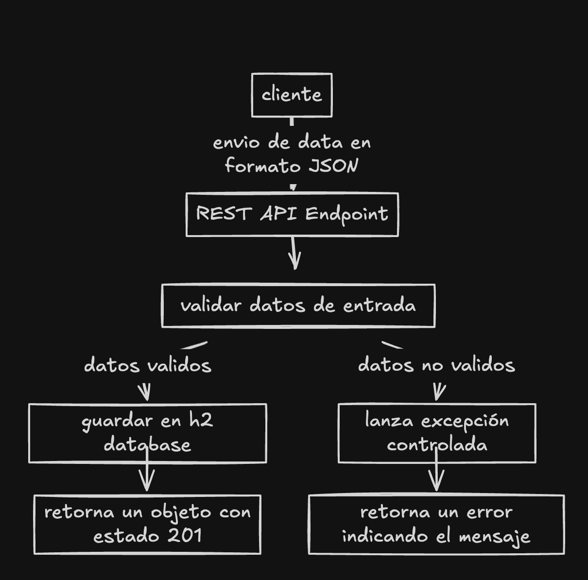

# Examen Tecnico

## Requisitos

Asegúrate de tener instalados los siguientes componentes:

- **Java 17**: Esta aplicación requiere Java 17.
- **Gradle**: Usado como sistema de construcción. Puedes instalarlo manualmente o usar el wrapper incluido.
- **Base de datos H2**: La aplicación utiliza una base de datos en memoria H2.
- **Spring Boot 3.3.5**: Usado como framework principal para el backend.

## Instrucciones de instalación y configuración

1. **Clonar el repositorio**

   Clona el repositorio del proyecto en tu máquina local:

   ```bash
   git clone <https://github.com/rricardob/examen_nisum.git>
   ```

2. **Configurar la base de datos H2**

   La aplicación está configurada para usar una base de datos en memoria H2, por lo que no es necesaria configuración adicional para la base de datos
   adicional a ello el proyecto tiene un script que crea las tablas necesarias.

   **OJO**: No hay que ejecutar ningun script el proyecto ya tiene uno que por defecto se ejecuta al iniciar la aplicacion

    - La URL de conexión es: `jdbc:h2:mem:testdb`
    - Usuario: `sa`
    - Contraseña: `password`

3. **Compilar la aplicación**

   ```bash
   ./gradlew clean build
   ```
4. **Ejecución de la aplicación**

   Una vez iniciada, la aplicación estará disponible en `http://localhost:8080`. Puedes acceder al panel de H2 para verificar la base de datos en `http://localhost:8080/h2-console`.

5. **Tests**

   Para ejecutar los tests, usa el siguiente comando:

   ```bash
   ./gradlew test
   ```
6. **Probar endpoints**

   para poder probar el endpoint de registro se agrega el cURL para su posterior importacion via postman o ejecucion directa en alguna terminal

   ```bash
   curl --location 'http://localhost:8080/api/v1/users' \
   --header 'Content-Type: application/json' \
   --data-raw '{
   "name":"ricardo",
   "email":"nuevousuario@hotmail.com",
   "password":"Abc123456",
   "phones":[
   {
   "number":"910162151",
   "cityCode":"1",
   "countryCode":"51"
   },
   {
   "number":"910162152",
   "cityCode":"1",
   "countryCode":"51"
   }
   ]
   }'
   ```

   adicional a ello tambien se puede probar mediante swagger con el link http://localhost:8080/swagger-ui/index.html#/

7. **Diagrama de la solucion**
   